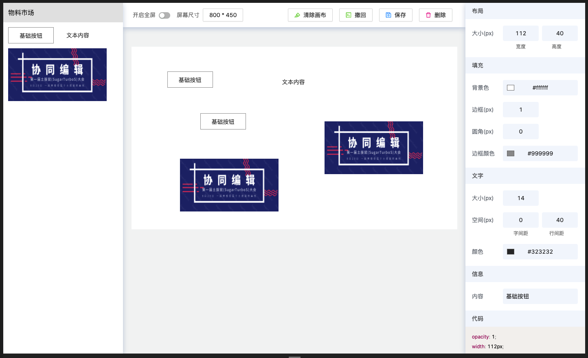

## dom-ui-toolbar

可视化低代码平台 dom-ui-toolbar

### 项目目标

主要用于学习

### 主要问题

- [x] 编辑器画布的设计
- [x] 左侧组件库的物料搭建
- [x] 右侧工具条的实现及交互效果
- [x] 拖拽组件至画布
- [x] 组件在画布中的随意移动
- [ ] 画布中组件按钮删除
- [ ] 画布中组件层级修改
- [ ] 画布中组件大小缩放
- [ ] 组件右键菜单-复制功能
- [ ] 组件右键菜单-剪切功能
- [ ] 组件右键菜单-粘贴功能
- [ ] 组件右键菜单-删除功能
- [ ] 按钮组-回退功能
- [x] 按钮组-清除功能
- [ ] 按钮组-保存功能
- [ ] 实现组件吸附效果
- [ ] 预览功能
- [ ] 绑定事件
- [ ] 绑定动画

## 开发

```bash
npm clone https://github.com/PDKSophia/dom-ui-toolbar.git
cd dom-ui-toolbar
npm run start
```

## 效果展示

1. 初始状态


2. 组件拖拽进画布



3. 组件可自由移动、层级覆盖、右侧组件工具条样式修改


