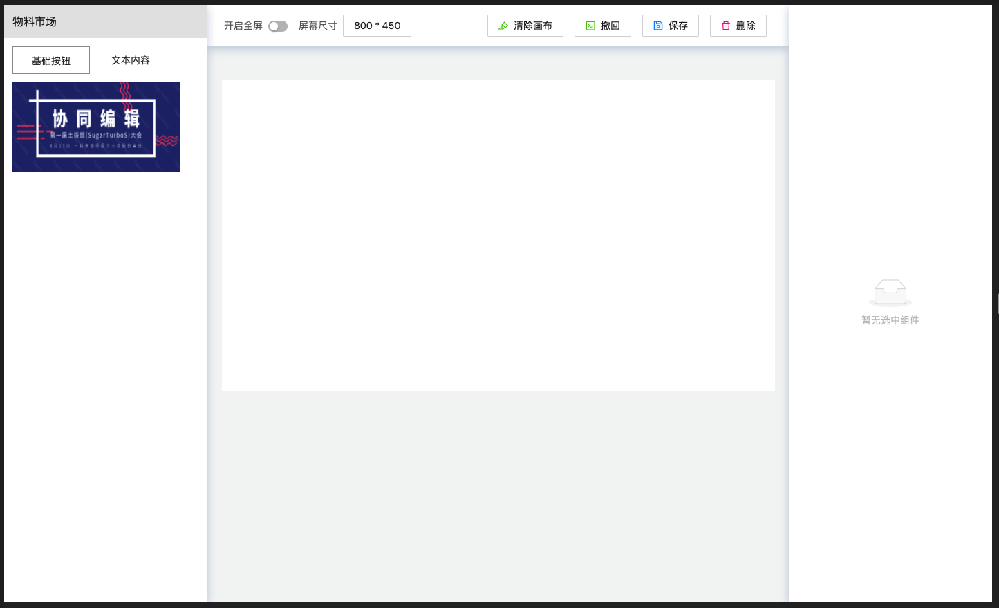
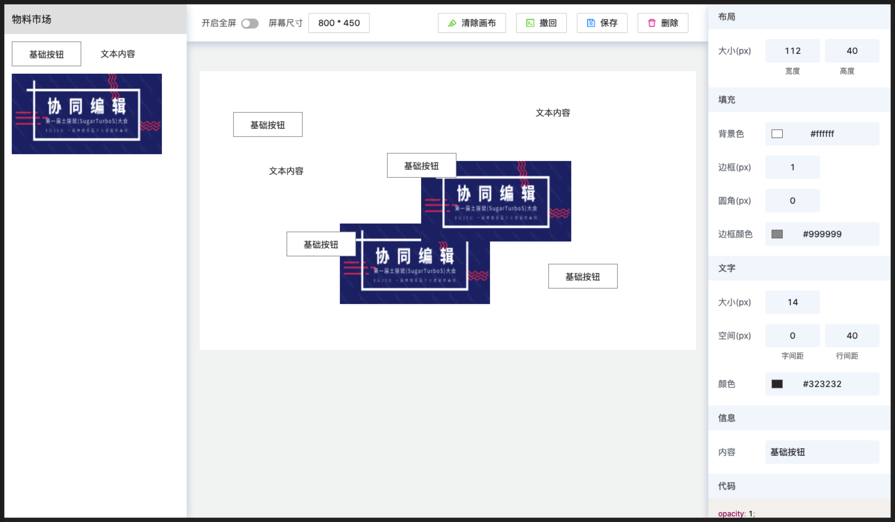

## dom-ui-toolbar

可视化&低代码组件平台 dom-ui-toolbar

### 项目目标

主要用于学习，针对以下功能进行小册配套

### 主要问题

- [x] 左侧组件库的物料搭建
- [x] 编辑器画布的设计
- [x] 拖拽组件至画布
- [x] 组件在画布中的随意移动
- [x] 右侧工具条的实现及交互效果
- [x] 组件接口模型
- [x] 按钮组-清除功能
- [x] 按钮组-删除功能
- [ ] 按钮组-撤销功能
- [ ] 按钮组-保存功能
- [ ] 画布中组件层级修改
- [ ] 画布中组件大小缩放
- [ ] 组件右键菜单-复制功能
- [ ] 组件右键菜单-剪切功能
- [ ] 组件右键菜单-粘贴功能
- [ ] 组件右键菜单-删除功能
- [ ] 实现组件吸附效果
- [ ] 预览功能
- [ ] 绑定事件
- [ ] 绑定动画

## 开发

```bash
// 1. 克隆项目
npm clone https://github.com/PDKSophia/dom-ui-toolbar.git

// 2. 进入项目
cd dom-ui-toolbar

// 3. 安装依赖
npm install

// 4. 运行项目
npm run start
```

## 效果展示

1. 初始状态



2. 组件拖拽进画布


3. 组件自由移动、层级覆盖



4. 组件内容更新，样式修改


